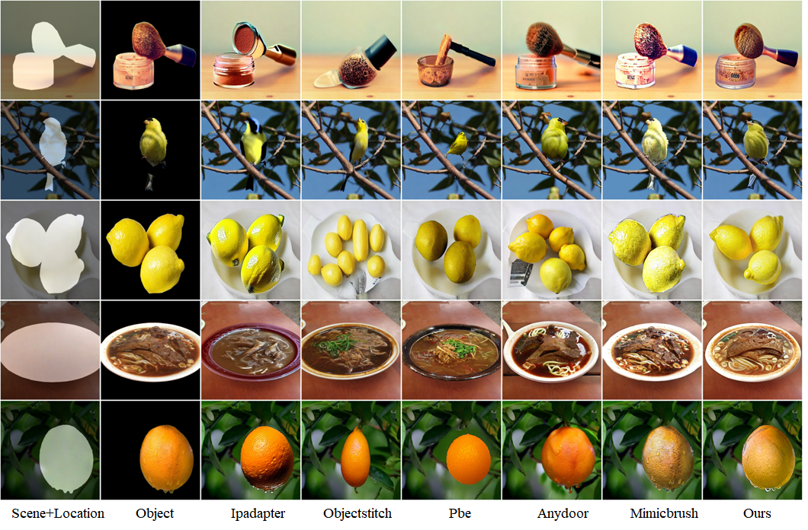

# DGAD

This is the official open-source code for the DGAD project.

## Results

### Box Prompt Results


### Mask Prompt Results


## Environment Setup

This project uses conda for environment management. Please refer to `environment.yml` for environment configuration:

```bash
conda env create -f environment.yml
conda activate brushnet
```

## Pre-trained Models Download

Please download the following pre-trained models from Hugging Face:

1. Stable Diffusion Inpainting Model:
   - Model Name: `models--runwayml--stable-diffusion-inpainting`
   - Download Link: https://github.com/faraday/runway-stable-diffusion-inpainting

2. BrushNet Segmentation Model:
   - Model Name: `segmentation_mask_brushnet_ckpt`
   - Download Link: https://huggingface.co/camenduru/BrushNet/blob/main/segmentation_mask_brushnet_ckpt/diffusion_pytorch_model.safetensors

After downloading, please place all models in the `pretrain_model` directory at the project root.

## Inference

Use the following command for inference:

```bash
python inference/inference_base_sdinpaint_ipadapter.py
```

### Input Requirements
For inference, you need to provide:
1. Source image: The background image where the object will be placed
2. Object image: The object to be inserted
3. Position information: Either a mask or bounding box indicating where the object should be placed in the source image

The input files should be organized as follows:
```
dataset_validation/
├── source/     # Background images
├── object/     # Object images to be inserted
└── mask/       # Mask images indicating object placement
```

## Training

Use the following command for training:

```bash
bash train.sh
```

### Data Format
The training data should be organized in JSON format. Please refer to `data_small.json` for the data structure. The JSON file should contain:

```json
{
    "images": [
        {
            "source": "path/to/source/image.jpg",
            "mask": "path/to/mask/image.png",
            "object": "path/to/object/image.jpg"
        },
        ...
    ]
}
```

After training is completed, extract the adapter weights using:
```bash
python tools/get_weight_brushadapter.py
```
Then you can proceed with inference using the extracted weights.

## Important Notes

- Ensure all pre-trained models are correctly downloaded and placed in the specified locations
- Make sure you have sufficient GPU memory for training and inference
- CUDA 11.7 or higher is recommended